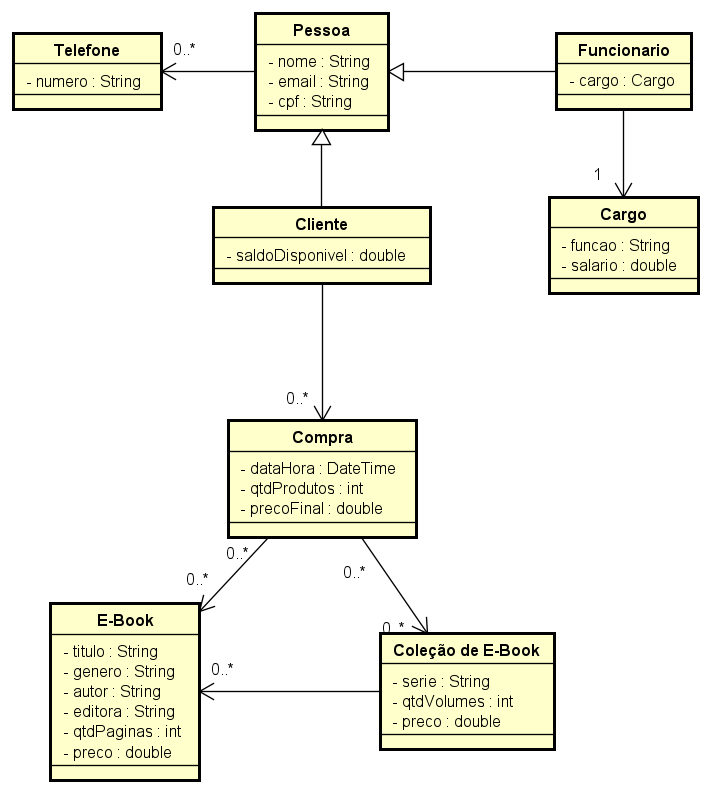
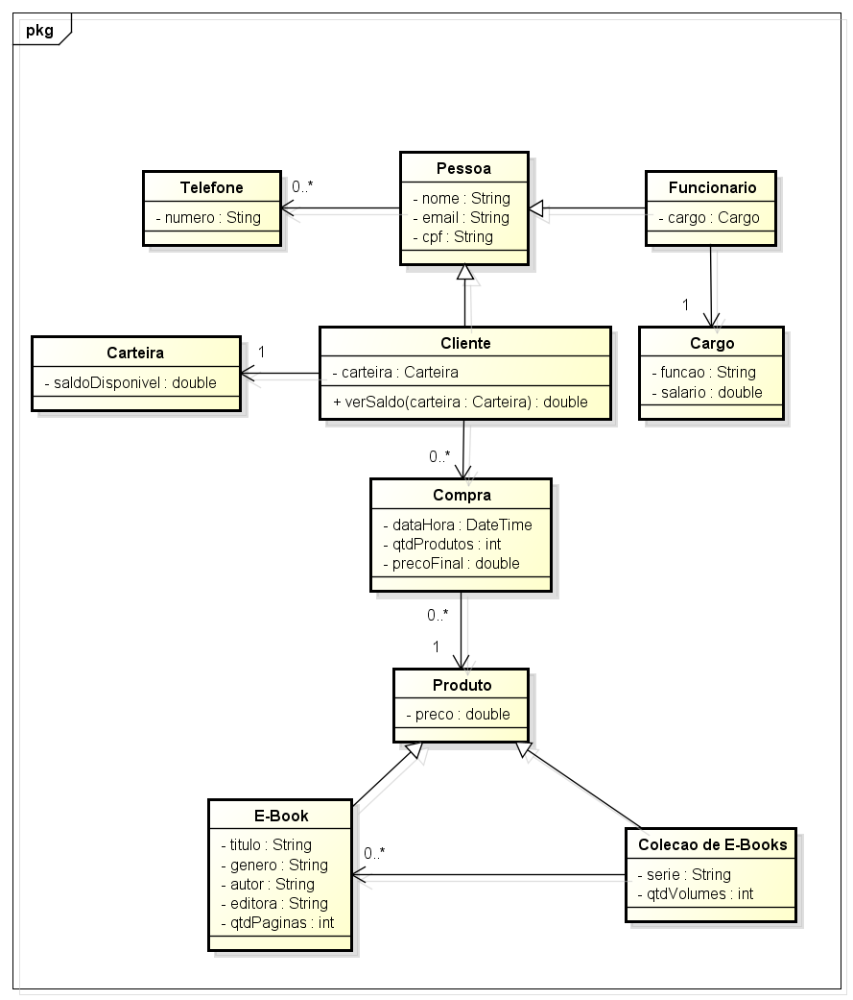
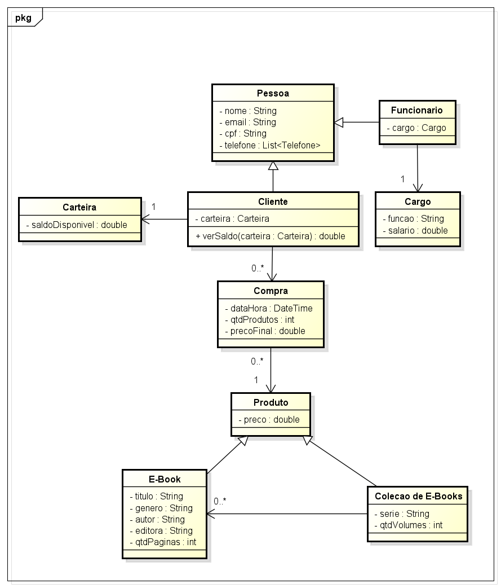
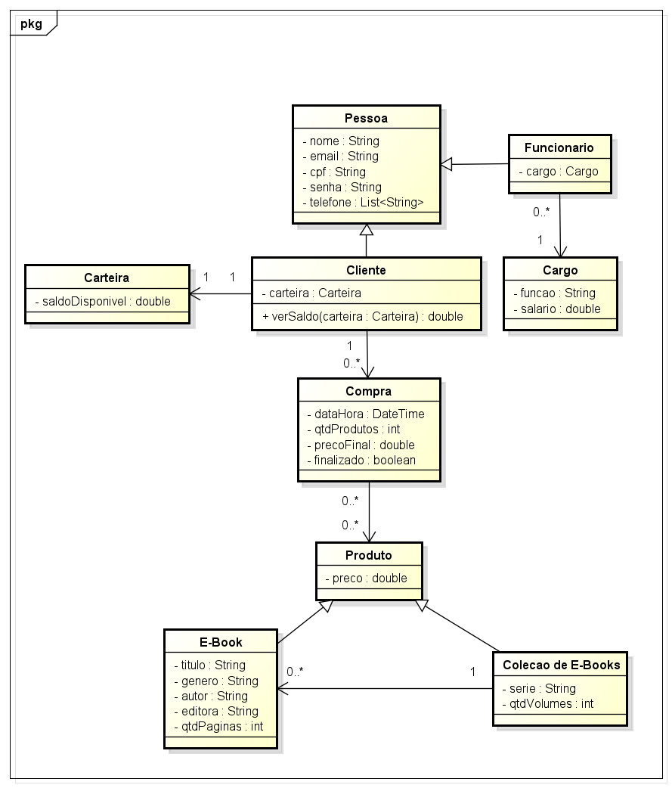
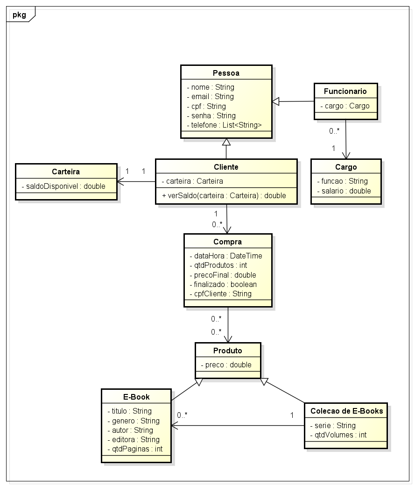

# Diagrama de classes
## Versionamento
| Data | Versão | Descrição | Autor(es) |
|:----:|:------:|:---------:|:---------:|
| 02/06/2023 | 0.1 | Criação do documento | [José Augusto](https://github.com/JoseAugustoFS) |
| 05/06/2023 | 0.2 | Adição das classes carteira e produto | [José Augusto](https://github.com/JoseAugustoFS) |
| 07/07/2023 | 0.3 | Substituição da classe telefone por uma lista | [José Augusto](https://github.com/JoseAugustoFS) |
| 14/07/2023 | 0.4 | Adição do atributo senha à classe pessoa | [José Augusto](https://github.com/JoseAugustoFS) |
| 26/07/2023 | 0.5 | Adição do atributo boolean finalizado à classe compra | [José Augusto](https://github.com/JoseAugustoFS) |
| 26/07/2023 | 0.6 | Adição do atributo string cpfCliente à classe compra | [José Augusto](https://github.com/JoseAugustoFS) |
| 26/07/2023 | 0.7 | Adição do atributo int nivelAcesso à classe cargo | [José Augusto](https://github.com/JoseAugustoFS) |

## Definição

&emsp;&emsp;O diagrama de classes no UML (Unified Modeling Language) é um tipo de diagrama de estrutura estática que descreve a estrutura de um sistema, mostrando as classes do sistema, seus atributos, métodos e os relacionamentos entre os objetos.

## Diagrama de classes

##### *Versão 0.1*

##### *Versão 0.2*

##### *Versão 0.3*

##### *Versão 0.4*

##### *Versão 0.5*

##### *Versão 0.6*

##### *Versão 0.7*

## Referências

1. Documentação de diagramas UML, Diagrama de Classes. Disponível em: [uml-diagrams.org](https://www.uml-diagrams.org/class-diagrams-overview.html). Acesso em: 02/06/2023.
